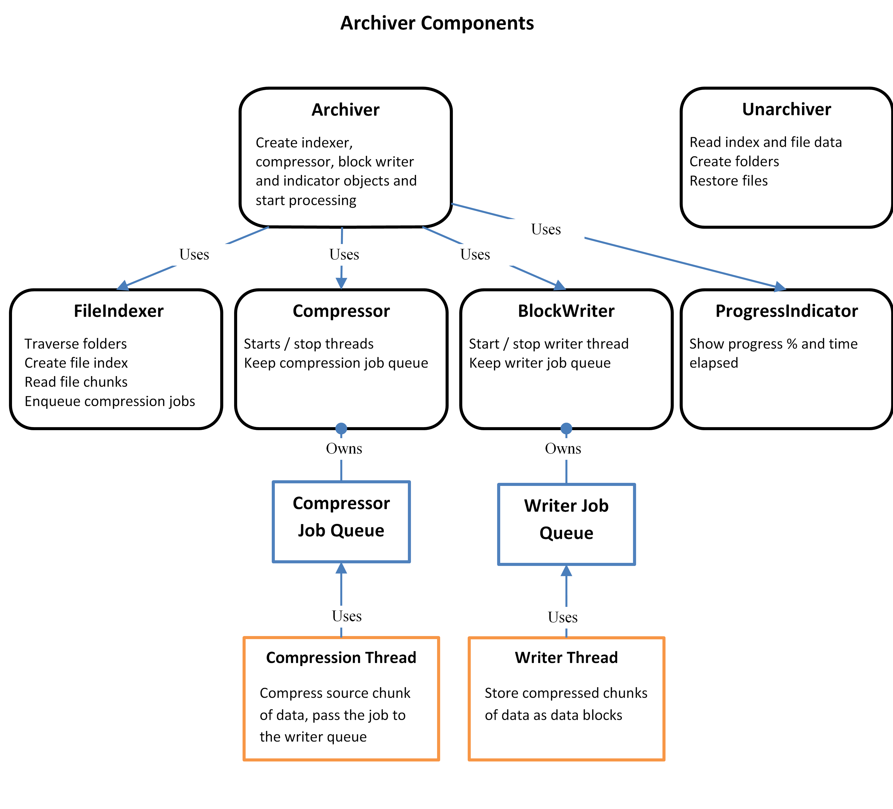
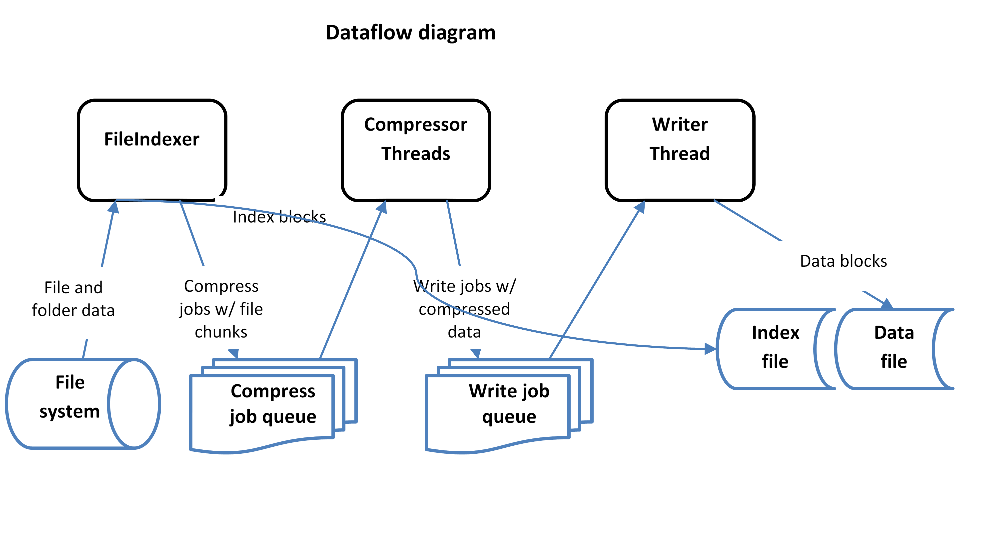
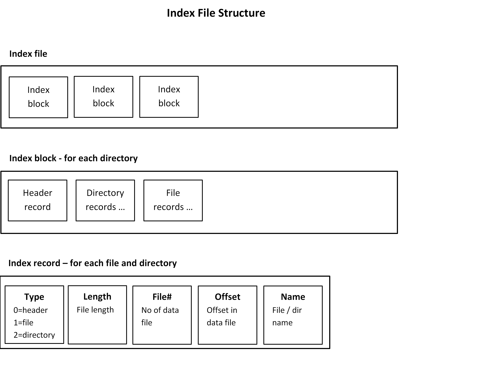
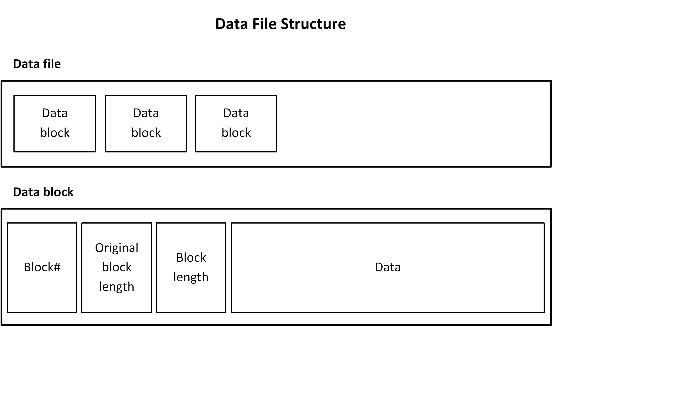

# vbackup
File archive and restore application.

## Requirements
* Command line application
* Use STL
* Create archive of a volume, e.g. C:
* Include all files
* Provide archive and restore commands
* Multi-thread
* Show progress bar
* Use ZLIB library for compression

## To do later / in the future
* Split data files in volumes of e.g. 4GB, like data.z.1, data.z.2, ...
* Archive and restore file attributes and permissions (access control lists)
* Much improved error handling is needed
* Special handling of soft/hard links?
* Restore on live system?

## Command line arguments
See the description in [CommandLineOptions.cpp](./src/CommandLineOptions.cpp)

## Design

The program traverses the source volume, creates index blocks for each directory 
with records for each file and subdirectory. The files are read in chunks and 
compression jobs created and placed in a compressor queue.

The program uses several classes for archiving, designed as independent components:
* Archiver is the main component
* FileIndexer traverses the directories
* Compressor runs the threads that compress source data chunks
* BlockWriter thread stores compressed blocks to disk
* ProgressIndicator shows time elapsed and current % complete.

The objects are independent of each other. The Archiver creates and wires them
with lambda functions, so that FileIndexer can store in the index the file 
offset and last block# in the compressed data file, the compressor threads to
pass jobs to the writing queue and ProgressIndicator to show current progress.

The restoring process is single threaded and very quick.

The program classes follow The rule of zero, https://cpppatterns.com/patterns/rule-of-zero.html

The program uses several threads for compression of files taking jobs from compression 
job queue, and one thread with a separate job queue for storing the compressed data blocks. 
The number of compression threads is equal to the number of machine threads available 
less one, as this seems to be optimal number, with the last thread used for the writer.
On large file systems, where file indexing may take long, it could be useful to use one less 
compression thread.

## Data structure reference
The program creates index files and data files, each of them comprised of consecutive blocks
as shown on the diagrams below.

### Index files
An index file contains directory blocks, one for each directory. Each directory block 
starts with a header record and contains records for files and subdirectories.

Index file = [directory-block] ...  
Directory block = [header record] [file or directory record] ...  
Record = [rec.type | length | file# | offset | last-datablock# | name]

### Data files

Data file = [data-block] ...  
Data block = [block-no|orig-length|data-length|data...]  

A data file is made up of data blocks containing compressed file data. Each data block 
starts with <block-no> and <data-length> fields and then compressed data from a file.  
  
block-no - seq. block number, equal to job#  
length - the length of the compressed data block  
orig-length - uncompressed data size  

## Useful information / code examples

* VShadow Volume Shadow Copy Service examples, https://github.com/Microsoft/Windows-classic-samples/tree/master/Samples/VShadowVolumeShadowCopy
* https://wj32.org/wp/2012/12/13/how-to-backup-files-in-c-using-the-volume-shadow-copy-service-vss/
* Progress bar, https://stackoverflow.com/questions/14539867/how-to-display-a-progress-indicator-in-pure-c-c-cout-printf
* ZLIB, https://www.zlib.net/zlib_how.html and PIGZ, https://github.com/madler/pigz
* ZLIB multi-thread, https://stackoverflow.com/questions/30294766/how-to-use-multiple-threads-for-zlib-compression

