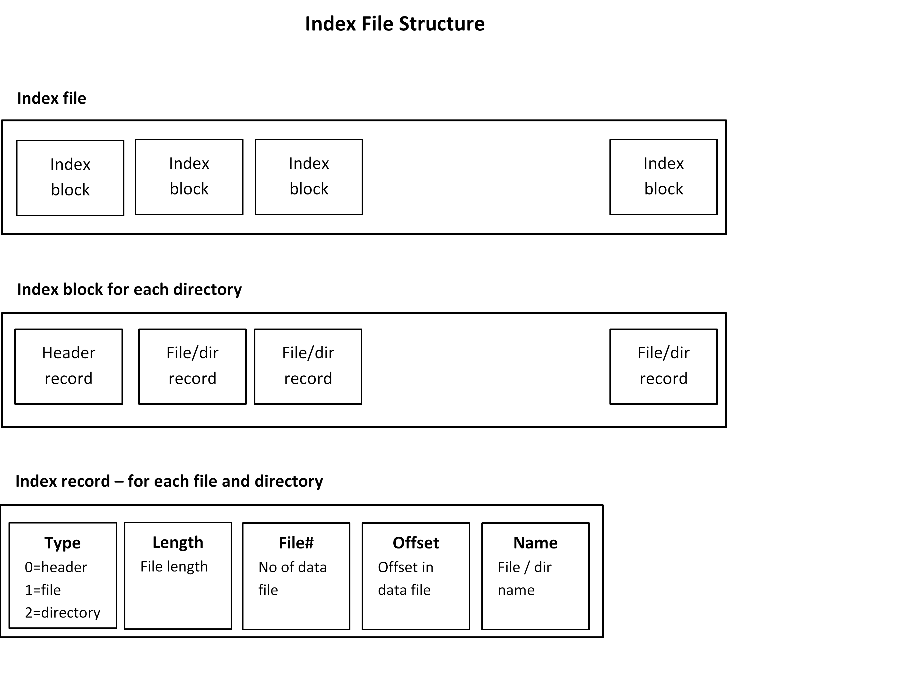

# vbackup

### Requirements
* Command line application
* Use STL
* Create archive of volume, e.g. C:
* Include all files
* Provide archive and restore commands
* Multi-thread
* Show progress bar
* Use ZLIB library for compression

### To do later / in the future
* Split data files in volumes of e.g. 4GB, like data.z.1, data.z.2, ...
* Archive and restore file attributes and permissions (access control lists)
* Much improved error handling is needed
* Special handling of links?

### Design

### Useful information / code examples

* VShadow Volume Shadow Copy Service examples, https://github.com/Microsoft/Windows-classic-samples/tree/master/Samples/VShadowVolumeShadowCopy
* https://wj32.org/wp/2012/12/13/how-to-backup-files-in-c-using-the-volume-shadow-copy-service-vss/
* Progress bar, https://stackoverflow.com/questions/14539867/how-to-display-a-progress-indicator-in-pure-c-c-cout-printf
* ZLIB, https://www.zlib.net/zlib_how.html and PIGZ, https://github.com/madler/pigz
* ZLIB multi-thread, https://stackoverflow.com/questions/30294766/how-to-use-multiple-threads-for-zlib-compression

